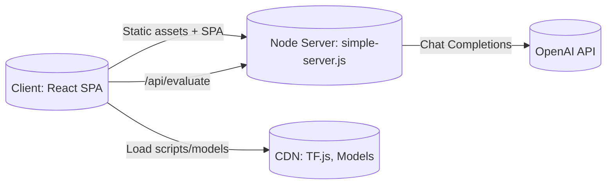
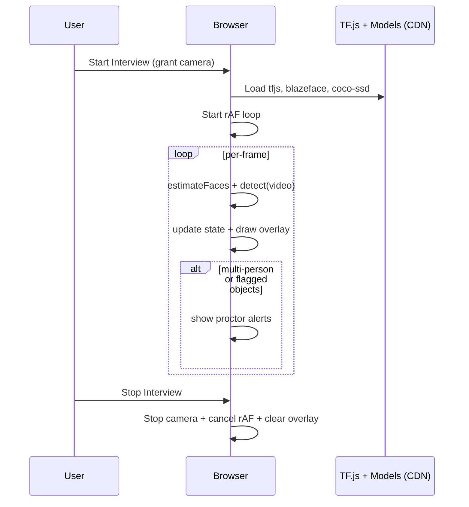
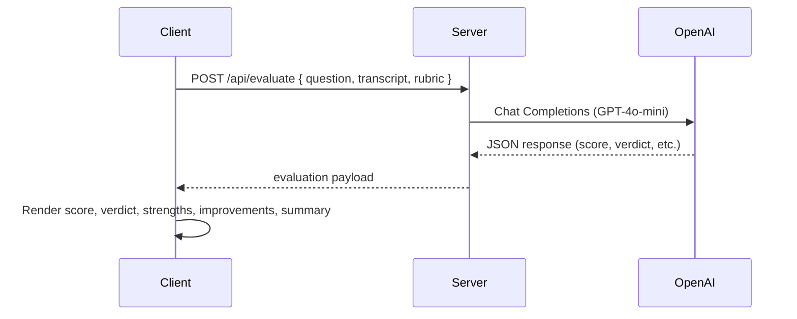

# Project Architecture

## Executive Summary
This project is a browser-based interview platform that provides:
- Real-time client-side proctoring (face/eye attention proxy, people/object detection) using TensorFlow.js models.
- Interview Room with transcript-based answer evaluation via OpenAI (GPT‑4o‑mini) through a lightweight Node server proxy.
- ATS (resume) screen and Technical screen that retain their simulation flows, with optional GPT‑4o‑mini evaluation for added insights.

Key differentiators:
- In-browser ML for proctoring (no backend GPU required).
- CDN-loaded models to minimize setup and improve portability.
- Strict-JSON LLM evaluation pipeline with a minimal server in `simple-server.js`.

---

## High-Level Architecture
- Frontend
  - React (Vite) SPA for core pages (Interview Room, ATSChecker, TechnicalTest, etc.).
  - Tailwind-based UI components and lucide-react icons.
  - Static HTML entry/fallback pages for compatibility.
- Browser-side ML (Proctoring)
  - TensorFlow.js runtime (CDN).
  - BlazeFace for face detection and an attention proxy (eye-contact heuristic).
  - coco-ssd (lite_mobilenet_v2) for people/object detection.
  - Canvas overlay + `requestAnimationFrame` loop for visualization.
- Backend (Local Node Server)
  - `simple-server.js` serves static assets and exposes `POST /api/evaluate`.
  - Proxies OpenAI Chat Completions (GPT‑4o‑mini). Requires `OPENAI_API_KEY`.
  - CORS + preflight support for local/dev usage.
- Data Layer
  - `Entities/*.js` (User, Interview, TechnicalQuestion) act as stubs/facades.
  - No database in this repo; persistence can be added later behind these facades.

---

## System Context Diagram

---

## Frontend Architecture
- Entry & Bootstrap
  - HTML: `index.html`, `index_new.html`, `simple_fixed.html`, `login.html`, `register.html`.
  - React: `src/main.jsx`, `src/App.jsx` bootstraps SPA.
- Pages
  - `Pages/InterviewRoom.jsx`
    - Camera capture (PIP) and overlay canvas.
    - Lazy-loaded TF.js models (BlazeFace + coco-ssd) via CDN.
    - rAF-based detection loop (faces, people, objects).
    - Alerts for multiple people and suspicious objects; simple attention proxy.
    - Transcript entry + “Evaluate with OpenAI” using `/api/evaluate`.
  - `Pages/ATSChecker.jsx`
    - Simulated upload + analysis progress retained.
    - Optional LLM evaluation card for pasted resume text.
  - `Pages/TechnicalTest.jsx`
    - Coding area, timer, tab monitoring, simulated scoring on completion.
    - Optional LLM evaluation for current code answer (feedback only).
  - Other pages: `CandidateDashboard.jsx`, `Analytics.jsx`, `HRdashboard.jsx`, etc.
- Components
  - `Components/ui/*`: UI primitives (button, input, card, dialog, textarea, etc.).
  - `Components/interview/ScheduledInterview.jsx`: interview cards/list items.
- Styling
  - Tailwind CSS (`tailwind.config.js`, `postcss.config.js`, `src/index.css`).

---

## Proctoring Subsystem (Client-only)
- Model Loading
  - Scripts dynamically injected from CDN: `@tensorflow/tfjs`, `@tensorflow-models/blazeface`, `@tensorflow-models/coco-ssd`.
  - Models loaded once and stored in React refs.
- Processing Loop
  - `requestAnimationFrame` loop runs while the interview is active.
  - BlazeFace: detects faces and landmarks; derives an eye-contact/attention proxy from face centering.
  - coco-ssd: detects people and objects; counts persons and flags suspicious classes (e.g., cell phone, laptop, tv, book).
- Visualization
  - Canvas overlay draws face and object bounding boxes/labels each frame.
- Alerts & State
  - Multi-person warning; suspicious-object warnings.
  - States: `faceDetected`, `eyeContact`, `lookingAway`.
- Fallback
  - No simulation fallback: if models don’t load, proctoring doesn’t run and no fake metrics are shown.

### Proctoring Sequence

---

## LLM Evaluation Subsystem
- Frontend
  - Interview Room: Transcript → Evaluate with OpenAI → renders structured results.
  - ATS Checker: Pasted resume text → Evaluate with OpenAI → renders results (does not replace simulation flow).
  - Technical Test: Code + question → Evaluate with OpenAI → renders results (does not replace final simulated score).
- Backend: `simple-server.js`
  - `POST /api/evaluate`
  - Validates body, ensures `process.env.OPENAI_API_KEY` is present.
  - Calls OpenAI Chat Completions (`model: gpt-4o-mini`) with a strict JSON response format.
  - Returns `{ score, verdict, strengths[], improvements[], summary }` to the client.

### LLM Evaluation Sequence

---

## Simulation Flows (Retained)
- ATSChecker
  - Simulated upload & analysis progress are preserved for demos/offline usage.
  - Optional OpenAI evaluation is additive and independent.
- TechnicalTest
  - Simulated final score remains on completion.
  - Optional OpenAI evaluation provides feedback without replacing the simulated score.

---

## Security & Privacy
- API keys
  - `OPENAI_API_KEY` resides only on the server process; never exposed to the client.
- CORS
  - Enabled for local development; should be restricted for production.
- Browser permissions
  - Camera/Mic permissions managed by the browser; user consent required.
- Data storage
  - No DB in this repo; `Entities/` act as stubs. If persistence is added, ensure secure storage, PII handling, and logging policies.

---

## Performance & Reliability
- Proctoring
  - Lightweight models (BlazeFace, lite-mobilenet-v2 for coco-ssd) chosen for real-time inference on typical devices.
  - rAF loop ties to display refresh rate; performance varies by device.
- LLM
  - Low-temperature, strict JSON responses for consistency.
  - Network-dependent latency to OpenAI; consider batching or debounce for heavy use.
- Resilience
  - If TF.js/models fail, proctoring is disabled without simulated metrics.
  - If OpenAI calls fail, friendly UI errors are shown in evaluation cards.

---

## Tech Stack Summary
- Frontend: React (Vite), Tailwind CSS, lucide-react, custom UI components.
- Proctoring: TensorFlow.js, BlazeFace, coco-ssd (CDN-loaded), Canvas overlay.
- Backend: Node.js `http` server (`simple-server.js`), static file serving, `POST /api/evaluate`.
- LLM: OpenAI Chat Completions (GPT‑4o‑mini) via server proxy.
- Build/Tooling: Vite, PostCSS, Tailwind.

---

## Directory Structure (Selected)
- `Pages/`
  - `InterviewRoom.jsx` – camera + proctoring + transcript evaluation.
  - `ATSChecker.jsx` – simulated resume screening + optional LLM evaluation card.
  - `TechnicalTest.jsx` – coding test + simulated scoring + optional LLM evaluation.
- `Components/ui/` – UI primitives (button, input, card, dialog, textarea, etc.).
- `Components/interview/` – interview-related components (e.g., ScheduledInterview.jsx).
- `Entities/` – stubs for data access (User, Interview, TechnicalQuestion).
- `integrations/Core.js` – integration helpers placeholder.
- `simple-server.js` – static server + `/api/evaluate` proxy.
- `src/` – SPA bootstrap (App.jsx, main.jsx, styles).

---

## Runbook (Local)
1) Prerequisites: Node.js 18+, internet access, OpenAI API key.
2) Start server:
   - Windows PowerShell:
     - `$env:OPENAI_API_KEY="sk-your-key"`
     - `node simple-server.js`
   - macOS/Linux:
     - `export OPENAI_API_KEY="sk-your-key"`
     - `node simple-server.js`
3) Open browser: `http://localhost:3000/index_new.html` (or `simple_fixed.html`).
4) Interview Room: allow camera/mic, start interview, optional transcript evaluation.
5) ATS/Technical: continue using simulation; LLM evaluation is optional.

---

## Roadmap & Enhancements
- Proctoring
  - Replace attention proxy with head-pose/iris-based gaze estimation.
  - Configurable thresholds and flagged object classes.
- LLM
  - Role/skill-based rubrics; persistence of evaluations and proctoring events.
  - Rate limiting, usage analytics, and caching.
- Backend
  - Move to a full-featured framework, add auth, logging, monitoring, HTTPS.
  - Add a real database; upgrade `Entities/` to data gateways.
- Frontend
  - Clarify UI labels: "Simulation" vs "OpenAI feedback".
  - Centralized state management and routing normalization as scope grows.

---

## Assumptions & Limitations
- No persistent datastore in this codebase.
- CDN dependency for TF.js/models requires internet.
- Minimal Node server; not production-hardened.
- Proctoring metrics are heuristic and should be validated for policy use.
